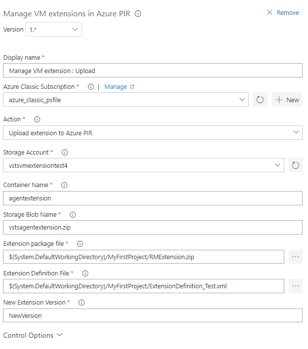

# Manage VM extensions in Azure PIR
This extension allows a user to manage Virtual Machine extensions in Azure Platform Image Repository. It contains a VSTS task which Creates/Updates/Deletes VM extension in Azure PIR based on the action the user selects. The task name is 'Manage VM extensions in Azure PIR'. It requires an 'Azure Classic' service endpoint. Currently, the task just submits the Create/Update/Delete extension requests to Azure PIR. It does not wait for the operation to replicate across geolocations.

## Create/Update VM extension in Azure PIR

* The task requires the extension packkage and an extension definition file as artifacts. [Here](https://github.com/Azure/azure-marketplace/wiki/Publishing-and-testing-the-Extension-handler#create-a-definition-file-with-extension-meta-data) is a sample extension definition file.
* If the VM extnesion does not exist, the task creates the extension.
* It first uploads the extension package to an Azure Classic storage account. If the storage account/container does not exist, the task first created them.

## Delete VM extension from Azure PIR
* For deleting an extension, the task requires the full extension name(<Publisher name>.<Extension name>), and the complete extension version to delete(<Major version>.<Minor version>.<Patch>.<Revision>).
